<div align="center">
  
</div>

<p align="center">
  <a href="https://linkedin.com/in/shaischaudhry"></a>
  <a href="mailto:shais.rehman.cs@gmail.com"></a>
</p>

Senior AI engineer, five years in, mostly remote with US teams.

My work tends to sit between machine learning and backend infrastructure. Computer vision models, retrieval systems, and the services that have to keep them alive once they leave the notebook. Healthcare and industrial platforms for the most part, which is a nice way of saying the output has to be right and somebody will ask you why it wasn't.

I do my own deployment. AWS, Azure and GCP, containers, IaC, the boring parts.

Currently at Devsinc. Before that, four years at Devntech.

### Stack

**ML and vision** &nbsp;


**Cloud and infra** &nbsp;


**Services and data** &nbsp;


**Models** &nbsp;


<details>
<summary>How I usually wire a model into a service</summary>

<br/>

```text
                      ┌───────────────────────────────────────┐
  request ──────────► │  durable workflow  (replayable, typed) │
                      └──────────────────┬────────────────────┘
                                         │
                ┌────────────────────────┴────────────────────────┐
                ▼                                                 ▼
    ┌───────────────────────┐                    ┌────────────────────────────┐
    │   DETERMINISTIC       │                    │        MODEL               │
    │  ───────────────────  │                    │  ────────────────────────  │
    │  scoring              │ ◄──── gate ─────── │  inference / generation    │
    │  thresholds           │                    │  behind one interface, so  │
    │  business rules       │                    │  the backend is swappable  │
    │  schema validation    │                    │                            │
    └──────────┬────────────┘                    └─────────────┬──────────────┘
               │                                               │
               │                              typed contract + repair loop
               │                                               │
               │                    ┌──────────────────────────┴──────────┐
               │                    │  retry → reprompt → cheaper model →  │
               │                    │  deterministic path → human queue    │
               │                    └──────────────────────────┬──────────┘
               ▼                                               ▼
    ┌──────────────────────────────────────────────────────────────────────┐
    │  traces: tokens, latency, cost per tenant, full call tree            │
    └──────────────────────────────────────────────────────────────────────┘
```

Two things I keep coming back to.

The model produces output, it never decides an outcome. Scoring and thresholds stay on the deterministic side of that wall, which is what makes the whole thing auditable when somebody asks how a result was reached.

A retry is step one of five, not a recovery strategy. Reprompt, fall back to something cheaper, fall back to a deterministic path, then put it in front of a human. Each tier logs why it fell through, so failure modes end up as data rather than anecdotes.

</details>

<br/>

<div align="center">
  <picture>
    <source media="(prefers-color-scheme: dark)" srcset="https://raw.githubusercontent.com/shaischaudhry/shaischaudhry/output/github-snake-dark.svg" />
    <source media="(prefers-color-scheme: light)" srcset="https://raw.githubusercontent.com/shaischaudhry/shaischaudhry/output/github-snake.svg" />
    
  </picture>
</div>
